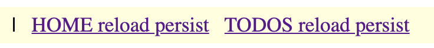

# Vue and Svelte together

This repo shows how to use Vue and Svelte together in the same app to demonstrate the following objectives.

> In all points below we could substitute Vue with any other framework, such as Angular or React (but Svelte stays)

## Objectives
 
1. How to use Svelte components within an existing app, based on another front-end framework, in this case Vue
    
2. How to communicate between Vue components and Svelte components (stores, props, events)
    
3. How to create app pages (routes), which reload the whole page to allow us to use a completely different framework to the one used for the rest of the app, while retaining state

4. Using web components for the app shell (toolbars, menus, sidebars, notifications), so that they can be re-used

## Why would you want to mix Vue and Svelte in the same app? 

In most cases there would be no reason to do this, because both Vue and Svelte are great full featured front-end frameworks in their own right. However, if you did want to do this to take advantage of Svelte within your Vue, Angular or React app, then this repo shows you how you might go about it. 

### Why Svelte?

Because Svelte is special, for two reasons. 

#### Svelte is a framework compiler

Svelte is a framework compiler not a framework library. This means that there are no runtime libraries to include or worry about when building for production. No conflicting runtime library versions. 

When Svelte compiles your components for production it generates JavaScript and includes only what you have used from the framework in the built bundles.

> Note: If you use libraries in your Svelte components, you may still encounter some version issues to resolve. 

#### Svelte Web Components

Svelte can build your feature as a web component, also known as a custom element. Custom elements are basically HTML tags, which you can use in most modern frameworks (Angular, React, Vue) or with pure HTML and JS.

## Installation

Clone this repo and change it or pick bits out of it and use in your own app.

Next, open your terminal and `cd` into the folder into which you cloned the repo and run the following command, which will download and install all the necessary npm packages.

```bash
npm i
```

## Usage

To start the app you need to run the npm task "dev". It will start up a dev-server on localhost, port 3000. Click the link in the console, and the app will open up in your browser. You should see something like this.

## The app

This is the home page of the app. 


It has a menu bar. The menu bar is a Svelte web-component, which means it can be used anywhere.   


The home page title


And below that we have the contents of a Vue store, which initially contains a list of tasks. This is visible at all times in every part of this app, to show how changes to the store made in Svelte components are reflected in real-time in the Vue part of the app. 


### Menu bar sections

The menu bar at the top has three sections. 

#### First section


This section has links to the part of the app that shows how to use Svelte web components within the Vue app. All these links perform front-end only routing using the browser history API, meaning that the page is never reloaded and instead the front-end vue-router swaps components in and out, thereby changing what's displayed, as the url updates.

This section of the app shows standard web app features, such as a routable page "home", and a sub route with a param passed to it "home/42". This is nothing special and purely there to show typical web app functionality.

The link "todos" routes to a Vue page that wraps a Todos micro feature developed with Svelte and built as a web component. This web component accepts a `todos` prop from the Vue wrapper and emits an `update` event when the todos list changes. The functionality is limited on purpose, as we are only trying to show how to communicate between Vue and the Svelte web component.

You can delete tasks in the todos list and see the Vue store update accordingly. There is no add task functionality - just reload the page if you want deleted tasks to reappear. 

> As you click between the three links, notice that the data in the store is preserved. 

#### Second menu section


The links in this section will reload the page loosing any task list changes you have made. 

Why do we do this? To simulate loading a page with a different framework in it. Yes, I realise it's the same framework and even the same code in this case, but the example is just as valid as if it were different code with a different framework. You will have to reload the page if you don't want the two frameworks, or even the same framework but different version, to clash with each other.


#### Third menu section



The links in this final section will reload the page, but also preserve the state of the task list. This is in contrast to the previous section that looses the state. 

We preserve state by storing it in localStorage, for simplicity, and then re-hydrating the Vue store with it when the app starts up, see [/src/store.js](./src/store.js).


## Contributing
Pull requests are welcome. For major changes, please open an issue first to discuss what you would like to change.

Please make sure to update tests as appropriate.

## License
[MIT](https://choosealicense.com/licenses/mit/)
